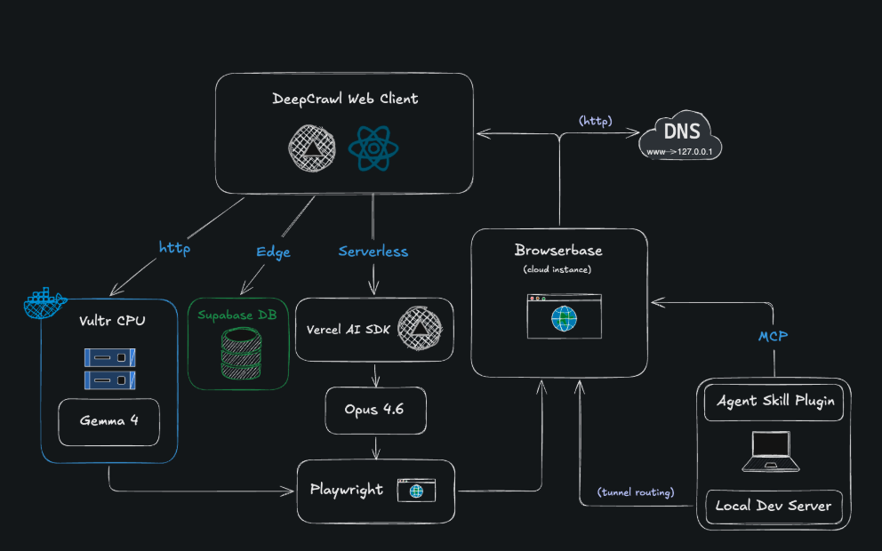

# DeepCrawl
[](#)
[](LICENSE)
[](#)

### AI-Powered UI Testing, Reimagined

Define reusable UI test flows, execute them with AI agents, and gain precise visibility into where each run succeeds or fails.

DeepCrawl combines the speed and adaptability of AI-driven automation with the reliability, structure, and transparency of a modern testing framework.

## Overview


## Problem We Solve
Existing UI testing tools are either too manual and brittle or too opaque when AI agents are involved.

Teams want to test real user UI workflows without writing every test entirely in code and without blindly trusting an autonomous black-box agent.

## Workflow
Add a URL, create UI test workflows in a visual interface or from natural language, and run those workflows through an agent-backed browser session.

The system shows the exact flow, execution progress, and failure points so tests are reusable, debuggable, and understandable. There are many customizable options such as branching workflows, reusable test templates, and execution modes.

## Dev Setup

First, add API keys to .local.env located in root dir
```
NEXT_PUBLIC_SUPABASE_URL=
NEXT_PUBLIC_SUPABASE_ANON_KEY=
ANTHROPIC_API_KEY=
BROWSERBASE_API_KEY=
BROWSERBASE_PROJECT_ID=
GEMMA_KEY=
AI_PROVIDER=
VULTR_GEMMA_URL=
```
Then download packages and run app
```
npm i
npm run dev
```

## MCP Server: DeepCrawl

In addition to the web app, TesterArmy ships an [MCP](https://modelcontextprotocol.io/) server — **Deepcrawl** (`mcp/`) — that exposes the same UI-testing capabilities to coding agents like Claude Code, Codex, etc. It runs locally as a standalone Node process — no Next.js, Supabase, or DB required (state lives in `~/.deepcrawl/`).

### Setup
Build the server once:
```
cd mcp
npm i
npm run build
```

Then register it. 

**Claude Code:**
```
claude mcp add deepcrawl -- node /absolute/path/to/lahacks26/mcp/dist/index.js
```

**Cursor / Windsurf** (add to `~/.cursor/mcp.json` or your IDE's equivalent):
```json
{
  "mcpServers": {
    "deepcrawl": {
      "command": "node",
      "args": ["/absolute/path/to/lahacks26/mcp/dist/index.js"],
      "env": {
        "ANTHROPIC_API_KEY": "sk-ant-...",
        "BROWSERBASE_API_KEY": "bb_...",
        "BROWSERBASE_PROJECT_ID": "..."
      }
    }
  }
}
```

Then in your agent: *"Use deepcrawl to propose 3 tests covering the homepage of https://example.com."* See `mcp/README.md` for full details, limitations, and state layout.
